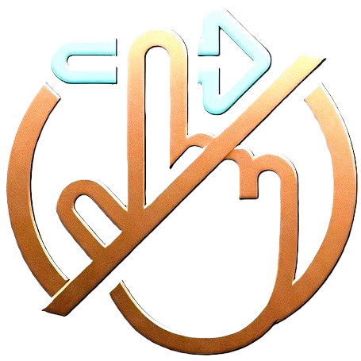

# Terms of Service

**Swock — Swipe Blocker for Short Videos**

**Last updated: 2026-10-10**

These terms set out the rules for installing and using Swock. Please read them before you
install the app. Section headings and the plain-language notes in *italics* are there to help you
find your way; the text of each section is what applies.

## Contents

- [Acceptance of terms](#acceptance-of-terms)
- [License](#license)
- [Using the app](#using-the-app)
- [Accessibility service](#accessibility-service)
- [Intellectual property](#intellectual-property)
- [Disclaimer of warranties](#disclaimer-of-warranties)
- [Limitation of liability](#limitation-of-liability)
- [Termination](#termination)
- [Changes to these terms](#changes-to-these-terms)
- [Governing law](#governing-law)
- [Contact](#contact)

---

## Acceptance of terms

By installing, accessing or using Swock ("the App"), you agree to be bound by these Terms of
Service ("the Terms"). If you do not agree to these Terms, do not install or use the App.

---

## License

*In short: you may install and use Swock on your own phone, for yourself.*

The App is proprietary software. All rights are reserved by the copyright holder. No license is
granted to use, copy, modify, distribute or reverse engineer the App beyond the limited right to
install and run the App on your personal device for personal, non-commercial use.

---

## Using the app

| You may | You may not |
|:--------|:------------|
| Install and run the App on your personal device | Reverse engineer, decompile or disassemble the App |
| Choose which apps to protect | Modify or adapt the App, or create derivative works |
| Turn blocking on or off at any time | Distribute, sell or sublicense the App |
| Uninstall the App at any time | Use the App for any commercial purpose without a license |
| Report bugs and request features on GitHub | Remove copyright notices or trademarks |

The App is a digital wellbeing tool that blocks the swipe-to-next-video gesture in supported
apps. It is not a security tool, a parental control tool, or a guarantee against accessing
short-form video content.

---

## Accessibility service

*In short: Swock needs Android's accessibility permission to work, handles what it sees only on
your phone, and you can switch it off whenever you like.*

The App uses the Android Accessibility Service to intercept touch gestures. By turning on the
accessibility service, you acknowledge that:

- the App receives accessibility events and screen layout (node tree) data only from the 8
  supported apps, and raw touch events only while it protects a Shorts or Reels player,
- this data is processed on your device and is not stored or transmitted,
- the App only intercepts touches in supported apps that are switched on in its settings (all are
  on by default), and only while a Shorts or Reels player is detected, and
- you can turn off the accessibility service at any time in Android Settings.

See the [Privacy Policy](privacy-policy.md) for full details on how data is handled.

---

## Intellectual property

The App, including all source code, assets, branding, logos and documentation, is the exclusive
property of the copyright holder. "Swock", the Swock logo and "Made in Jurgistan" are trademarks
of the copyright holder.

---

## Disclaimer of warranties

*In short: Swock comes with no guarantees.*

THE APP IS PROVIDED "AS IS" WITHOUT WARRANTY OF ANY KIND, EXPRESS OR IMPLIED. The copyright holder
does not warrant that:

- the App will function uninterrupted or error-free,
- the App will block all swipe gestures in all situations,
- the App will remain compatible with future versions of supported apps, or
- the App will not interfere with other accessibility services.

The App is designed to add friction to compulsive scrolling. It is not a medical device, a
treatment for addiction, or a substitute for professional help.

---

## Limitation of liability

*In short: the copyright holder is not responsible for indirect losses from using Swock.*

IN NO EVENT SHALL THE COPYRIGHT HOLDER BE LIABLE FOR ANY INDIRECT, INCIDENTAL, SPECIAL,
CONSEQUENTIAL OR PUNITIVE DAMAGES, INCLUDING BUT NOT LIMITED TO:

- loss of use, data or profits,
- device malfunction or data loss,
- inability to access short-form video content, and
- any damages resulting from the App failing to block gestures.

Your use of the App is at your sole discretion and risk.

---

## Termination

These Terms end automatically if you uninstall the App. The copyright holder may end your right to
use the App at any time if you break these Terms.

---

## Changes to these terms

The copyright holder may change these Terms. Changes are posted in this document with a new "Last
updated" date. If you keep using the App after a change, you accept the revised Terms.

---

## Governing law

These Terms are governed by the laws of the copyright holder's jurisdiction. Any disputes shall be
resolved in the courts of that jurisdiction.

---

## Contact

For questions about these Terms, open an issue on the
[public GitHub repository](https://github.com/Made-in-Jurgistan/swock-public/issues).

Related documents: [Privacy Policy](privacy-policy.md) · [README](README.md) · [FAQ](FAQ.md)

---

© 2026 Made in Jurgistan. All rights reserved.

